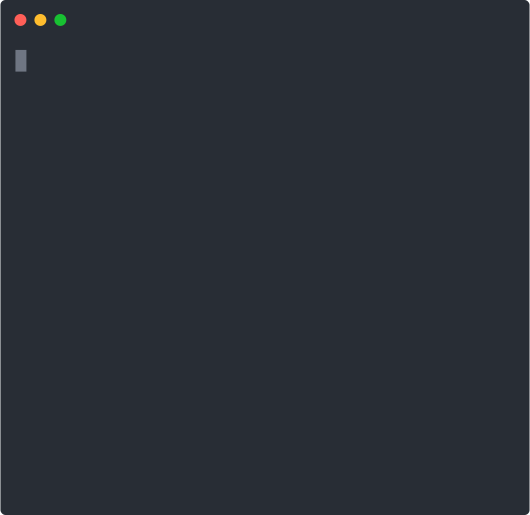
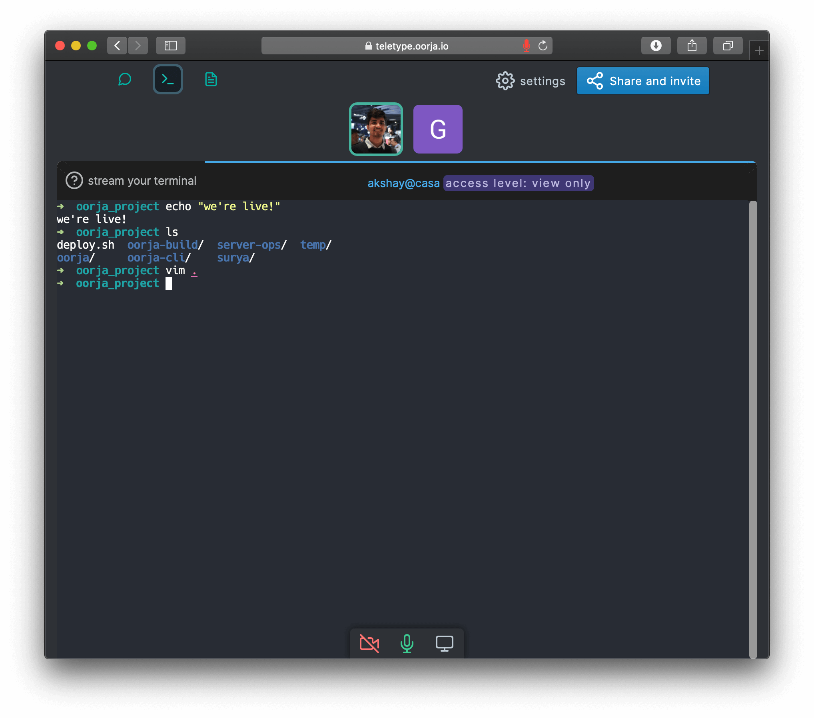

TeleType
=====

cli tool that allows you to share your terminal online conveniently. Check out [teletype.oorja.io](https://teletype.oorja.io) - show off mad cli-fu, help a colleague, teach, or troubleshoot.

[](https://oclif.io)
[](https://npmjs.org/package/oorja)
[](https://npmjs.org/package/oorja)
[](https://github.com/akshaykmr/teletype/blob/master/package.json)

<p align="center">
  
</p>

<p align="center">
  
</p>

Your stream can be view-only or collaboration enabled (command-line flag).

<!-- toc -->
* [Install and stream!](#install-and-stream)
* [Commands](#commands)
<!-- tocstop -->

# Install and stream!

requires nodejs `12.13.0` or later
- `npm install -g oorja`
- tip: [npm install without sudo](https://github.com/sindresorhus/guides/blob/master/npm-global-without-sudo.md)
- `teletype`
- `teletype -m`  (for collaboration mode)

**Note**
This is the cli companion for [teletype.oorja.io](https://teletype.oorja.io) which is a privacy focussed collaboration tool with more features like voice, notes, and chat - [privacy policy](https://teletype.oorja.io/privacy_policy).

For options: `teletype -h` 

If you prefer a completely self-hosted thing look at
these projects for web terminals - [wetty](https://github.com/butlerx/wetty) and [tty-share](https://github.com/elisescu/tty-share)


# Commands

* [`oorja teletype [ROOM]`](#oorja-teletype-room)
* [`oorja help [COMMAND]`](#oorja-help-command)

## `oorja teletype [ROOM]`

Launch a terminal streaming session in oorja.

```
USAGE
  $ oorja teletype [ROOM]

OPTIONS
  -h, --help         show CLI help

  -m, --multiplex    allows room users to WRITE TO YOUR SHELL i.e enables collaboration mode. Make sure you trust room
                     participants. Off by default

  -s, --shell=shell  [default: /usr/bin/fish] shell to use. e.g. bash, fish

ALIASES
  $ oorja tty

EXAMPLES
  $ teletype
  will prompt to choose streaming destination - existing room or create a new one.


  $ teletype 'https://oorja.io/rooms?id=foo'
  will stream to the room specified by secret link, you must have joined the room before streaming.


  $ teletype -m 'https://oorja.io/rooms?id=foo'
  Will also allow room participants to write to your terminal!
```

_See code: [src/commands/teletype/index.ts](https://github.com/akshaykmr/teletype/blob/v1.2.3/src/commands/teletype/index.ts)_

## `oorja help [COMMAND]`

display help for oorja

```
USAGE
  $ oorja help [COMMAND]

ARGUMENTS
  COMMAND  command to show help for

OPTIONS
  --all  see all commands in CLI
```

_See code: [@oclif/plugin-help](https://github.com/oclif/plugin-help/blob/v3.1.0/src/commands/help.ts)_
